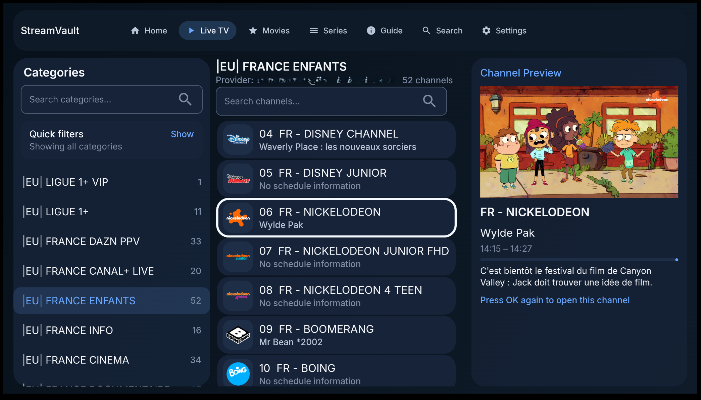
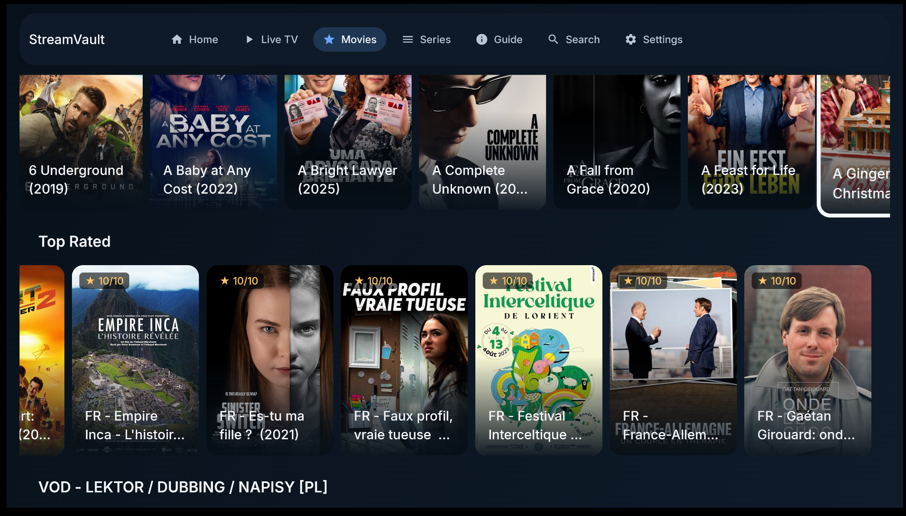
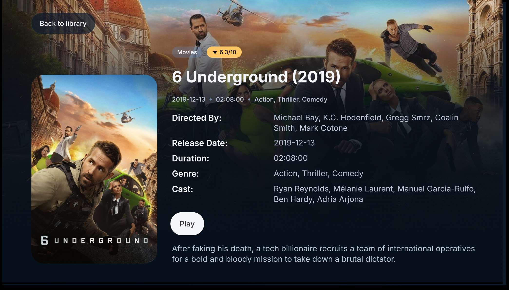
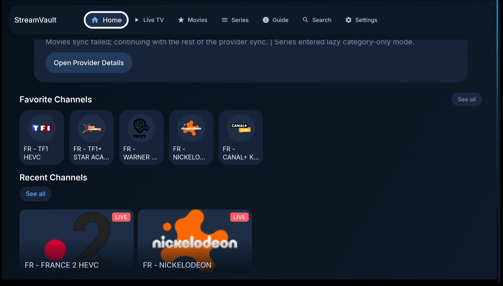
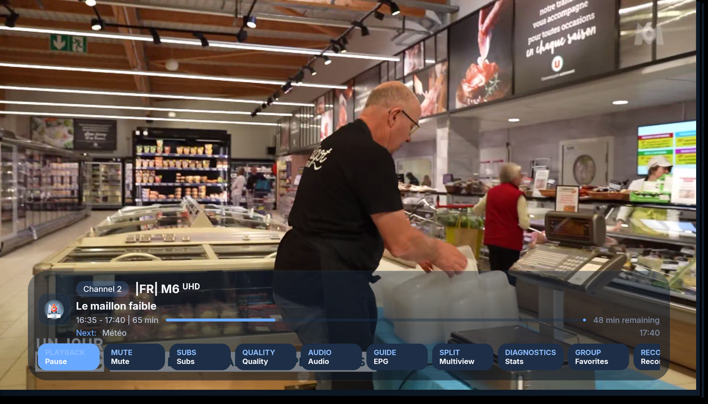
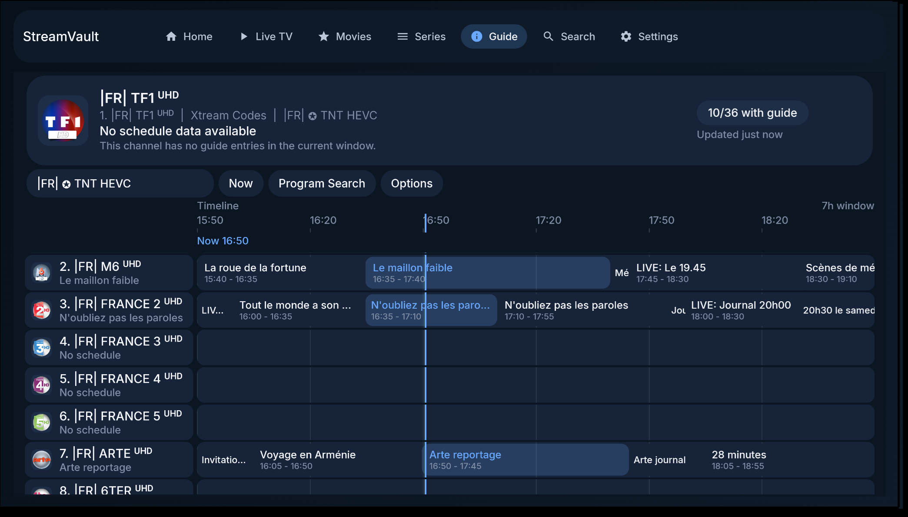
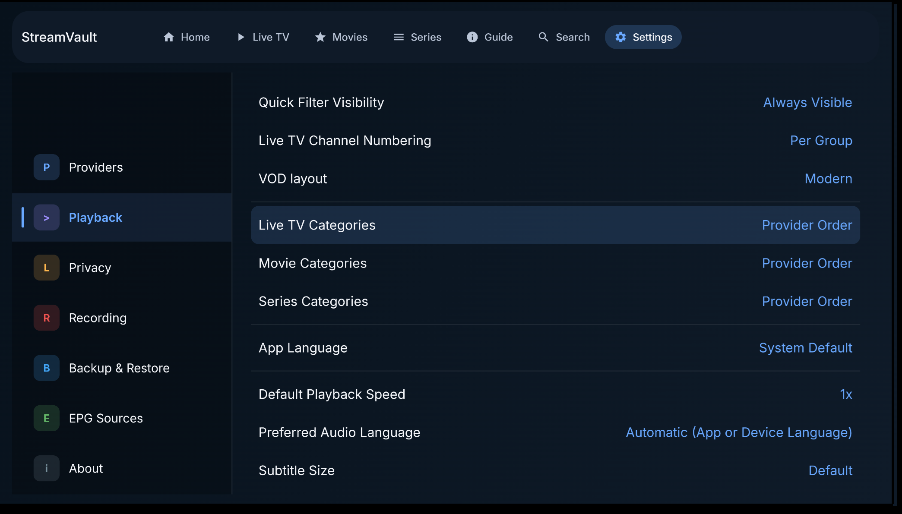
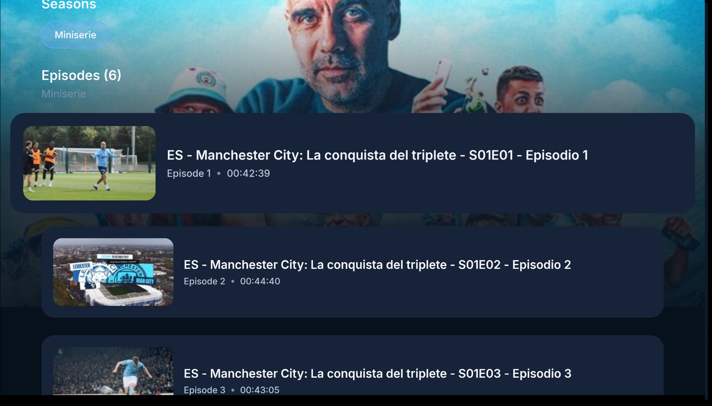

# Exacom TV

<p align="center">
	<a href="docs/CHANGELOG.md"></a>
	<a href="LICENSE"></a>
</p>

Exacom TV es un reproductor de IPTV pensado primero para Android TV, construido con Kotlin, Jetpack Compose, Room, Hilt y Media3.

Está diseñado para listas de canales grandes, navegación cómoda con control remoto, cambio rápido entre proveedores y una experiencia de reproducción pulida desde el sofá. Exacom TV soporta proveedores `M3U`, `Xtream Codes` y `Stalker Portal`, con flujos dedicados para `TV en vivo`, `Películas` y `Series`.

Construido primero para Android TV, Exacom TV se enfoca en lo que las apps de IPTV genéricas suelen hacer mal: navegación con D-pad, cambio rápido de canal, organización de bibliotecas grandes, y un reproductor que se siente bien usar desde el control remoto. También se soportan instalaciones en celulares y tablets, pero el objetivo principal de la interfaz es TV.

## Vista previa
<p align="center">
	
</p>

<p align="center">
	
	
</p>

<p align="center">
	
	
	
	
	
</p>

<p align="center">
	
</p>

## Lo más destacado

- Interfaz pensada primero para Android TV, con foco y navegación amigables para D-pad
- Soporte de listas para `Xtream Codes`, `Stalker Portal` y fuentes `M3U`, incluyendo archivos de lista locales
- Soporte de fuentes M3U combinadas, con cambio de fuente dentro del navegador para configuraciones de TV en vivo combinadas
- Navegación rápida de TV en vivo con modo de vista previa, favoritos, canales recientes, grupos personalizados y categorías fijadas
- Bibliotecas de películas y series con páginas de detalle, soporte de reanudación, cambio de episodios y reproducción automática del siguiente episodio
- Soporte completo de guía EPG con búsqueda, soporte XMLTV y archivo o catch-up del proveedor cuando está disponible
- DVR integrado con grabación programada, captura en segundo plano, reproducción de grabaciones y almacenamiento por defecto gestionado por la app
- Reproducción en pantalla dividida (multi-vista) para ver varios canales a la vez
- API de plugins para crear APKs complementarias que extiendan proveedores, reproducción, manejo de URLs de Cast o flujos de configuración
- Controles parentales sólidos con categorías protegidas por PIN y detección automática de categorías para adultos
- Integraciones de TV incluyendo Watch Next, recomendaciones del launcher, sincronización de TV Input, soporte de Cast y entrega de actualizaciones dentro de la app

## Funcionalidades

### Soporte de listas

- `Xtream Codes`
- `Stalker Portal`
- Listas `M3U` desde URLs y también archivos locales
- Flujos de configuración y sincronización separados para canales en vivo, películas, series y datos de guía
- Cambio rápido entre proveedores con ajustes específicos por proveedor
- Perfiles M3U combinados para fusionar varios proveedores M3U en una sola fuente de TV en vivo

### Navegación e interfaz de TV

- Diseñado primero para Android TV y navegación con D-pad
- Navegación rápida de canales con diseños aptos para listas grandes
- Entrada numérica por control remoto para ir directo a un canal
- Modo de vista previa mientras se navega entre canales
- Flujos de búsqueda y entrada de texto adaptados a TV

### TV en vivo y gestión de canales

- Favoritos y canales vistos recientemente
- Grupos personalizados para colecciones de canales propias
- Categorías fijadas que aparecen cerca del inicio del listado de TV en vivo
- Navegador opcional de proveedores o fuentes de TV en vivo para configuraciones basadas en M3U
- Mantener presionado sobre categorías en vivo para acciones como fijar, ocultar, bloquear o desbloquear, y gestión de grupos personalizados
- Reordenamiento de canales en favoritos y grupos personalizados
- Modos de numeración de canales por grupo o sobre todo el listado del proveedor
- Palabras de filtro predefinidas para limpiar la búsqueda de categorías en datos de proveedores ruidosos

### Guía, búsqueda y reproducción

- Vista de cuadrícula EPG completa
- Búsqueda de programas dentro de la guía
- Soporte de guía XMLTV con gestión integrada de fuentes EPG
- Ajustes manuales de coincidencia EPG y prioridad de fuentes desde Ajustes y la Guía
- Soporte de archivo o catch-up del proveedor cuando la fuente expone streams de repetición
- Reproducción con retroceso (timeshift) en vivo con hasta 30 minutos de buffer, incluso cuando el proveedor no ofrece catch-up
- Búsqueda global en TV en vivo, películas y series
- Multi-vista para ver varios streams en vivo a la vez
- Controles del reproductor para subtítulos, pistas de audio, relación de aspecto, velocidad de reproducción, calidad de video y Cast

### Grabación y reproducción

- Grabación DVR programada y en segundo plano para canales en vivo
- Recordatorios de programas desde la guía cuando solo quieres una notificación sin programar una grabación
- Detección de conflictos, persistencia y reparación de tareas de grabación
- Carpeta de grabación por defecto gestionada por la app, con opción de almacenamiento personalizado
- Reproducción dentro de la app de grabaciones completadas, con indicador visible de grabación activa en el reproductor
- Controles de resolución de problemas de reproducción para modo de decodificador, comportamiento de la sesión multimedia y ajustes de tiempo de espera
- Respaldo de audio con Media3 FFmpeg incluido para códecs de audio no soportados como AC-3, E-AC-3, DTS, MP2 y TrueHD, con diagnósticos y controles avanzados de compatibilidad

### Películas y series

- Dos diseños de VOD:
	- Navegación moderna por estanterías
	- Navegación clásica por categorías en barra lateral izquierda
- Páginas de detalle para películas y series
- Continuar viendo, historial de reproducción y acciones de reanudación desde la pantalla de detalle, con contexto de posición guardada
- Mantener presionado sobre categorías de VOD y grupos personalizados para acciones como ocultar, renombrar, eliminar o reordenar cuando aplica
- Cambio de episodios dentro del reproductor para series
- Reproducción automática del siguiente episodio cuando está disponible

### Controles parentales

- Ocultar categorías por completo
- Bloquear categorías con PIN
- Opción para ocultar contenido bloqueado de las vistas de navegación
- Detección de categorías para adultos usando indicadores del proveedor y heurísticas de nombres de categoría

### Idiomas y soporte de dispositivos

- La app incluye actualmente inglés más 25 paquetes de idioma traducidos
- La cobertura de idiomas es más amplia y la representación es más confiable en los idiomas soportados
- Construido primero para TV; se soportan celulares y tablets, pero no son el objetivo principal de diseño

### Integraciones de plataforma

- Integración con Watch Next de Android TV
- Recomendaciones del launcher y puntos de entrada de TV
- Sincronización de canales con el Android TV Input Framework
- Soporte de emisor de Google Cast

### Plugins

- Exacom TV se puede extender con APKs complementarias para Android.
- Los desarrolladores de plugins pueden exponer capacidades de proveedor, reproducción, reescritura de URLs de Cast y configuración renderizada o nativa.
- Consulta la documentación de la [API de Plugins de Exacom TV](docs/PLUGIN_API.md) para crear plugins compatibles.

## Tips rápidos para TV

- Mantén presionado un canal, película o serie para agregarlo a Favoritos o a un grupo personalizado.
- Mantén presionada una categoría en vivo para abrir acciones como fijar, ocultar, bloquear o desbloquear, y acciones de grupos personalizados como reordenar.
- En Películas y Series, mantén presionadas categorías o grupos personalizados para acciones de ocultar o gestión de grupos cuando estén disponibles.
- Mantén presionado un canal en vivo para ponerlo en cola en Pantalla Dividida.
- Usa las teclas numéricas del control remoto dentro del reproductor para saltar directamente a un canal.
- Mientras ves una serie, abre Episodios en el reproductor para cambiar de episodio sin salir a la pantalla de detalle.

## Descargas

- La app también puede detectar y descargar nuevas versiones desde dentro de la app a través de GitHub Releases.
- GitHub Actions ejecuta validación de build y pruebas en cada push y pull request.
- Los GitHub Releases solo se publican cuando el workflow se inicia manualmente con `workflow_dispatch`, para que no se creen versiones por error en cada push.

## Estructura del proyecto

- `app/` interfaz de la app Android, navegación, inyección de dependencias e integraciones de Android TV
- `data/` base de datos Room, sincronización, parsing, implementaciones de proveedores y repositorios
- `domain/` modelos, contratos de repositorio, managers y casos de uso
- `player/` abstracción de reproducción e implementación del reproductor con Media3
- `docs/` notas de arquitectura, documentación de la API de plugins y recursos de imágenes

## Compilación

Requisitos:

- Android Studio
- Android SDK
- JDK 17 u otro runtime de JDK 17 compatible con Gradle
- Android NDK solo si quieres recompilar localmente la extensión Media3 FFmpeg incluida

Comandos útiles:

```bash
./gradlew assembleDebug
./gradlew assembleRelease
./gradlew testDebugUnitTest
```

## Notas

- Exacom TV es un cliente de IPTV, no un proveedor de contenido.
- Usa solo listas, streams y fuentes de guía a las que tengas autorización de acceso.
- Los archivos de configuración local y de firma están intencionalmente excluidos del repositorio.

## Créditos

Exacom TV es un fork basado en [StreamVault](https://github.com/Davidona/StreamVault-IPTV), de **David Nashash (Davidona)**.

- Proyecto original: <https://github.com/Davidona/StreamVault-IPTV>
- Apoya al autor original: <https://ko-fi.com/davidona>

## Licencia

Este proyecto es un derivado de StreamVault y se rige por la StreamVault Source-Available License (No Comercial), incluyendo sus términos de atribución, nomenclatura, copyleft (share-alike) y uso no comercial.

Cualquier uso de este proyecto debe cumplir con los términos definidos en el archivo [LICENSE](LICENSE).
